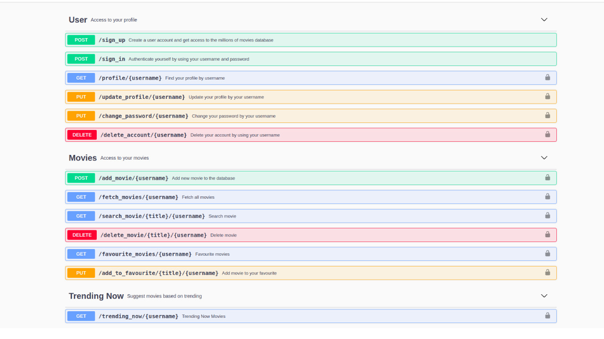

## Python Flask Microservices
The idea behind this application is to demonstrate the microservices architecture of today's modern system. In this demo, I have tried to show the basic microservices REST-API concepts of a tech & entertainment industry (i.e [Netflix](https://netflix.com)), and if we look at the system design of Netflix, it runs around more than 10,000+ microservices to manage the entire system, so in system-design, it's quite important to understand this concept.


## Technical Overview
The Proof of Concept written using python and it uses a flask web framework to define the routes and to store the data in the server it uses mongodb database, and for authentication, it uses [JWT Token](https://jwt.io/) framework.

In this project, you will find three different types of microservices.

1. Users
2. Movies
3. Trending Now

### Swagger API Documentation
The Swagger API docs can be accessible via [http://127.0.0.1:5000/api/docs](http://127.0.0.1:5000/api/docs) and to test the API endpoints you need to authorize yourself using your jwt access token.



### Installation
``````````````````````````````````````````````````````````````````````````````````
git clone https://github.com/anshumanpattnaik/python-flask-microservices
cd python-flask-microservices
pip install -r requirements.txt
source venv/bin/activate
python3 run.py

Open http://127.0.0.1:5000 to view in the browser.
```````````````````````````````````````````````````````````````````````````````````

### Build and run docker image

```````````````````````````````````````````````````````
docker build -t python-flask-microservices .
```````````````````````````````````````````````````````

```````````````````````````````````````````````````````````````````````````````
docker run -it --name python-container -p 5000:5000 python-flask-microservices
```````````````````````````````````````````````````````````````````````````````

### License
This project is licensed under the [MIT License](LICENSE)
